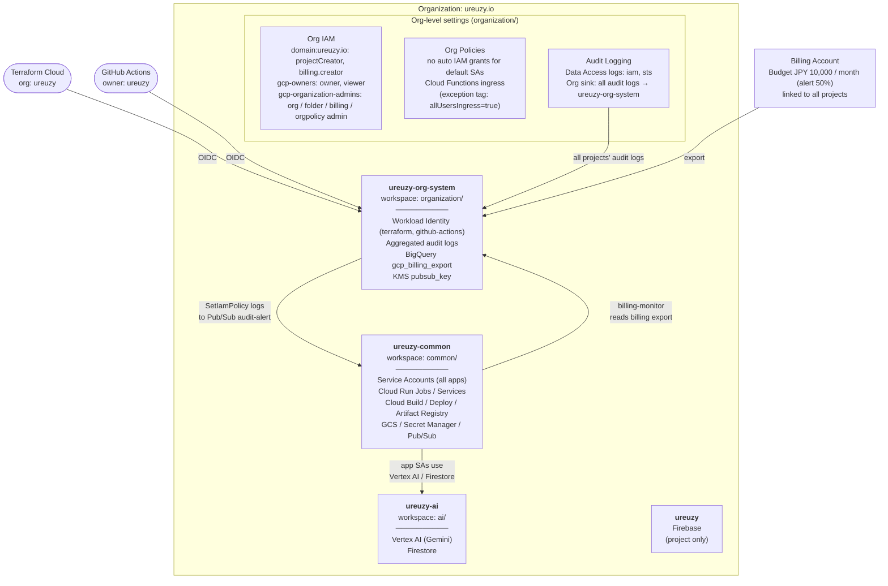

# google-cloud-terraform

Google Cloud Platform infrastructure managed with Terraform, using Terraform Cloud as the remote backend.

## Structure

| Directory | Workspace | GCP Project | Purpose |
|-----------|-----------|-------------|---------|
| [organization/](organization/) | `google-cloud-terraform` | `ureuzy-org-system` | Org policies, projects, billing, logging, workload identity |
| [common/](common/) | `google-cloud-terraform-common` | `ureuzy-common` | Cloud Run, Cloud Build/Deploy, GKE, secrets, storage |
| [ai/](ai/) | `google-cloud-terraform-ai` | `ureuzy-ai` | Firestore, AI Platform permissions |

Each directory is an independent Terraform root module with its own state.

## Architecture



Terraform Cloud authenticates to every workspace through the Workload Identity pool in `ureuzy-org-system`. For the application architecture inside `ureuzy-common`, see [common/README.md](common/README.md#architecture).

## Prerequisites

- Terraform `1.14.4`
- Terraform Cloud organization: `ureuzy`
- GCP region: `asia-northeast1` (Tokyo)
- Google provider: `~> 7.16.0`

## Usage

```bash
cd <directory>  # organization/ or common/ or ai/
terraform init
terraform plan
terraform apply
```

Before changing anything, read [DEVELOPMENT.md](DEVELOPMENT.md). Coding agents also follow [AGENTS.md](AGENTS.md).

## Dependency

```
organization/ --> common/ --> ai/
```

`organization/` creates projects and org-level resources. `common/` defines service accounts referenced by `ai/` via data sources.
