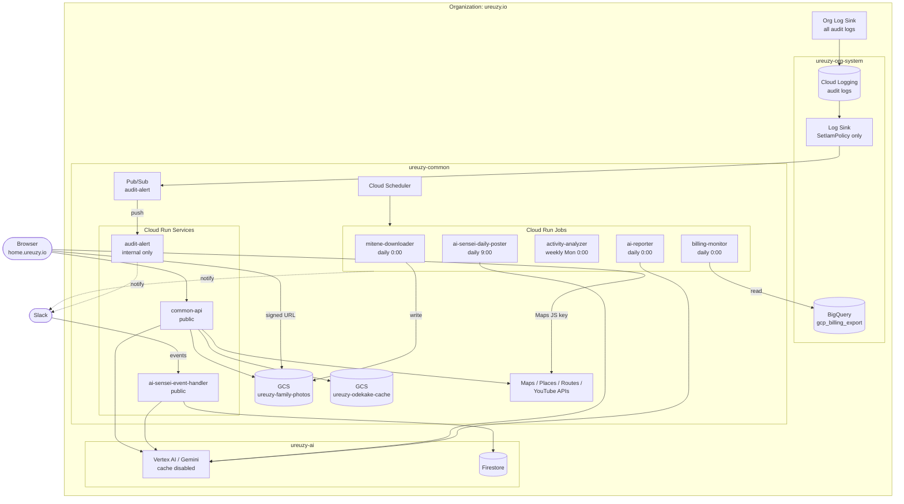
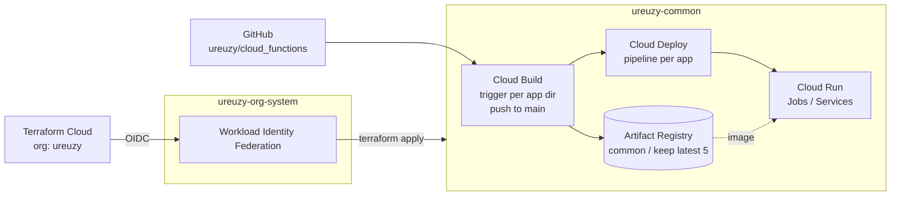

# common

Common infrastructure resources for application workloads.

- **Project**: `ureuzy-common`
- **Workspace**: `google-cloud-terraform-common`

## Resources

| File | Description |
|------|-------------|
| projects.tf | Project data source and API enablement |
| cloudrun.tf | Cloud Run services and jobs |
| cloudbuild.tf | Cloud Build triggers (GitHub push to main) |
| clouddeploy.tf | Cloud Deploy pipelines and targets |
| gke.tf | GKE Autopilot cluster |
| schedulers.tf | Cloud Scheduler jobs for periodic Cloud Run execution |
| serviceaccounts.tf | Service accounts (managed via `for_each`) |
| iam.tf | IAM bindings and public access settings |
| secrets.tf | Secret Manager secrets (managed via `for_each`) |
| artifactregistry.tf | Artifact Registry (Docker) with cleanup policy |
| storage.tf | Cloud Storage buckets |
| pubsub.tf | Pub/Sub topics and subscriptions |
| monitoring.tf | Monitoring and alerting |

## Cloud Run Services

| Name | Type | Scheduler |
|------|------|-----------|
| mitene-downloader | Job | Daily 0:00 JST |
| billing-monitor | Job | Daily 0:00 JST |
| activity-analyzer | Job | Weekly Mon 0:00 JST |
| ai-reporter | Job | Daily 0:00 JST |
| ai-sensei-daily-poster | Job | Daily 9:00 JST |
| ai-sensei-event-handler | Service | - |
| audit-alert | Service | - |
| common-api | Service | - |

## Architecture

### Runtime

### CI/CD

Cloud Run Job/Service definitions (`job.yaml` / `service.yaml`) live in `ureuzy/cloud_functions`; Terraform only imports them and ignores `template` changes. Dotted Slack edges are inferred from the Slack secrets, not defined in Terraform.

Not drawn: Secret Manager (used by most Cloud Run apps) and the Monitoring alert. See the [root README](../README.md) for the organization-wide view.
